<h1 align="center">🎂 Cakein – Cake Ordering App UI Design</h1>

<p align="center">
  <b>A modern and user-friendly cake ordering mobile app UI designed in Figma.</b>
</p>

<p align="center">
  
  
  
</p>

<p align="center">
  <a href="https://www.figma.com/proto/58nxQoptrj1nH5IHjItldg/CakeInApp?node-id=721-10487&starting-point-node-id=721%3A10487&t=rWgMob40z0BTruuL-1" target="_blank">
    
  </a>
</p>

<h2>📖 About The Project</h2>

<p>
  <b>Cakein</b> is a modern cake ordering mobile application UI/UX
  design created in <b>Figma</b>. The application is designed to provide
  users with a simple, attractive, and convenient way to discover,
  explore, save, and purchase cakes online.
</p>

<p>
  The project focuses on creating a smooth shopping experience with
  features such as authentication, cake discovery, search, wishlist,
  cake details, additional cake recommendations, cart management,
  and checkout.
</p>

<h2>🎯 Project Objective</h2>

<ul>
  <li>Create a modern and attractive cake ordering application.</li>
  <li>Provide a simple and intuitive user experience.</li>
  <li>Allow users to easily discover different cakes.</li>
  <li>Provide cake search functionality.</li>
  <li>Allow users to save their favorite cakes.</li>
  <li>Allow users to add and manage cakes in their cart.</li>
  <li>Show additional and recommended cakes.</li>
  <li>Create a smooth purchase and checkout flow.</li>
</ul>

<h2>✨ Features</h2>

<h3>🔐 Login & Signup</h3>

<ul>
  <li>User login screen.</li>
  <li>New user registration screen.</li>
  <li>Email and password input fields.</li>
  <li>Clean authentication interface.</li>
  <li>Easy navigation between Login and Signup.</li>
</ul>

<h3>🏠 Home Page</h3>

<ul>
  <li>Welcome section.</li>
  <li>Featured cakes.</li>
  <li>Popular cake categories.</li>
  <li>Special offers and promotions.</li>
  <li>Recommended cakes.</li>
  <li>Quick access to All Cakes.</li>
  <li>Wishlist and Cart access.</li>
</ul>

<h3>🔎 Search</h3>

<ul>
  <li>Search cakes by name.</li>
  <li>Dedicated search bar.</li>
  <li>Search result display.</li>
  <li>Easy access to cake details.</li>
  <li>Search-friendly product browsing.</li>
</ul>

<h3>🍰 All Cakes</h3>

<ul>
  <li>Complete cake collection.</li>
  <li>Cake cards with images.</li>
  <li>Cake name and price.</li>
  <li>Ratings and product information.</li>
  <li>Add to Wishlist option.</li>
  <li>Add to Cart option.</li>
  <li>View detailed cake information.</li>
</ul>

<h3>🎂 Additional Cakes</h3>

<ul>
  <li>Recommended cakes.</li>
  <li>Related cake suggestions.</li>
  <li>Similar product recommendations.</li>
  <li>Additional cake options during the purchase journey.</li>
  <li>Easy navigation to other cake products.</li>
</ul>

<h3>🛍️ Cake Details & Purchase Popup</h3>

<ul>
  <li>Large cake image preview.</li>
  <li>Cake name.</li>
  <li>Cake price.</li>
  <li>Cake description.</li>
  <li>Product information.</li>
  <li>Quantity selection.</li>
  <li>Add to Cart button.</li>
  <li>Purchase popup.</li>
  <li>Recommended cakes within the purchase flow.</li>
</ul>

<h3>❤️ Wishlist</h3>

<ul>
  <li>Add cakes to favorites.</li>
  <li>Remove cakes from favorites.</li>
  <li>View all saved cakes.</li>
  <li>Quick access to favorite products.</li>
  <li>Move favorite cakes to cart.</li>
</ul>

<h3>🛒 Add To Cart</h3>

<ul>
  <li>Add cakes to shopping cart.</li>
  <li>Increase cake quantity.</li>
  <li>Decrease cake quantity.</li>
  <li>Remove products from cart.</li>
  <li>View individual product prices.</li>
  <li>View total cart amount.</li>
  <li>Proceed to checkout.</li>
</ul>

<h3>💳 Checkout</h3>

<ul>
  <li>Order summary.</li>
  <li>Selected cake details.</li>
  <li>Quantity and total price.</li>
  <li>Delivery information.</li>
  <li>Payment section UI.</li>
  <li>Place order interface.</li>
</ul>

<br>
<h2 align="center">🎂 Cakeinn App Preview</h2>

<p align="center">
  <b>Explore the Cakein cake ordering app UI designed in Figma</b>
</p>

<br>

<p align="center">
  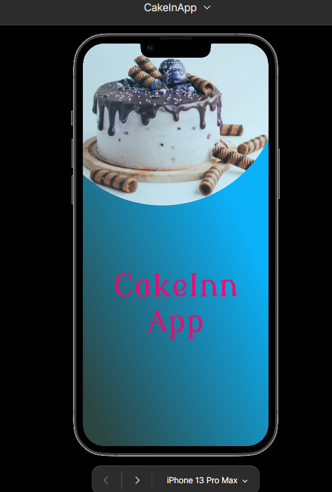
  
  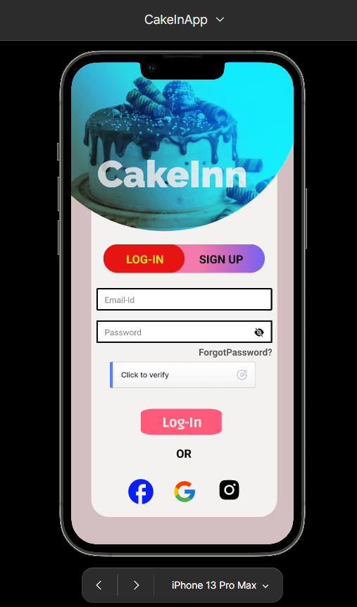
  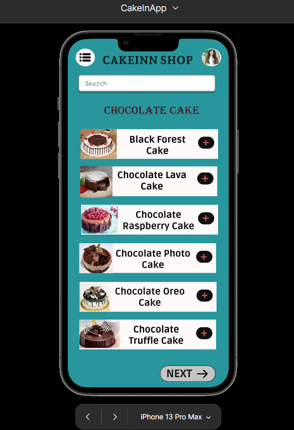
  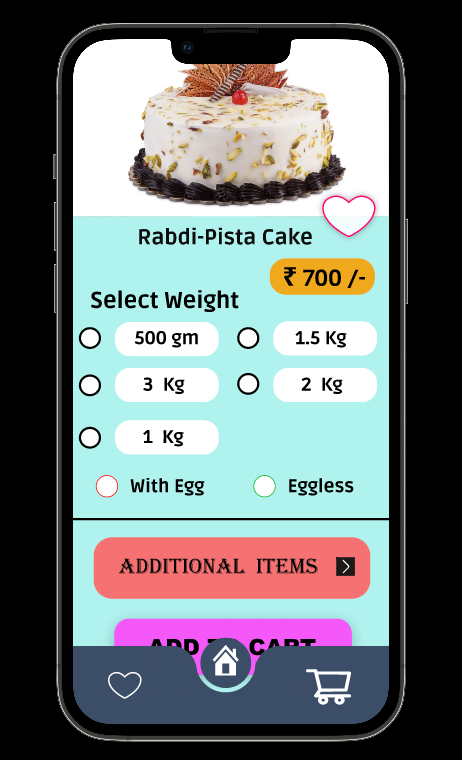
  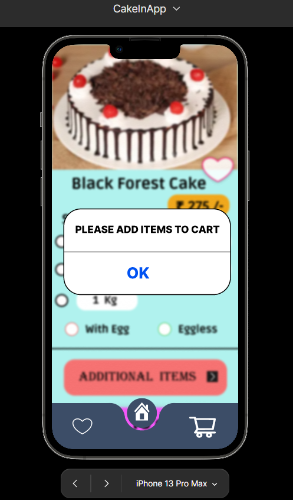
  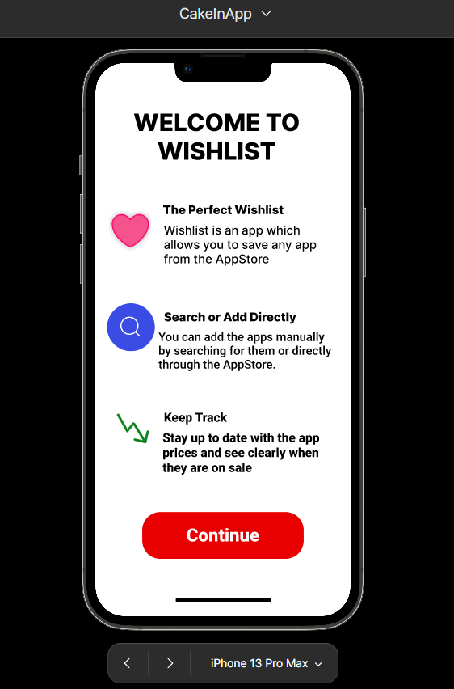
  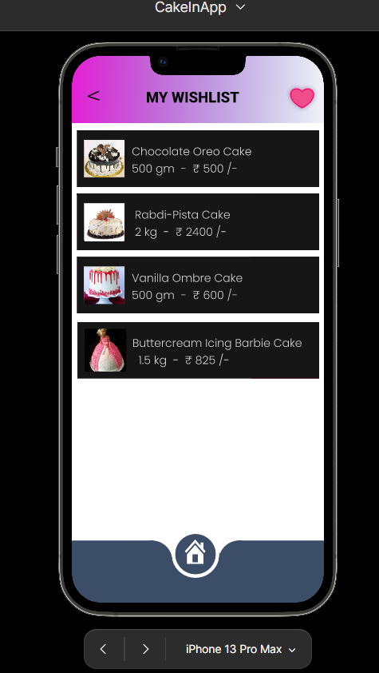
  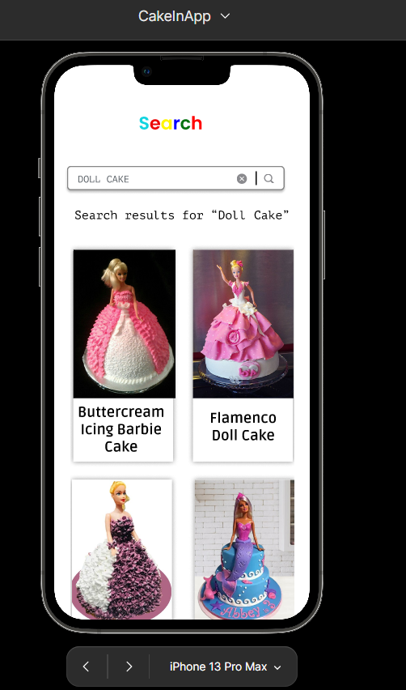
  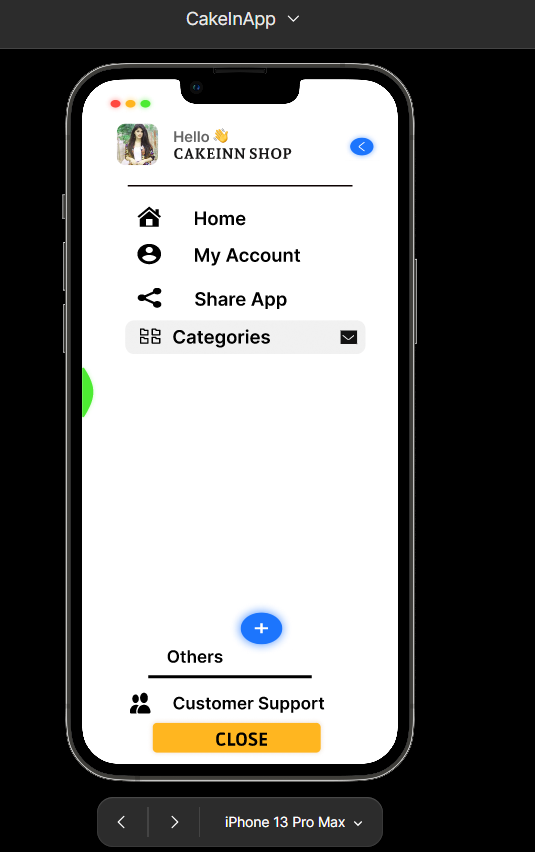
  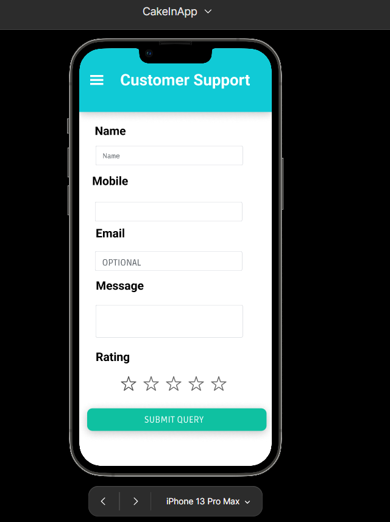
  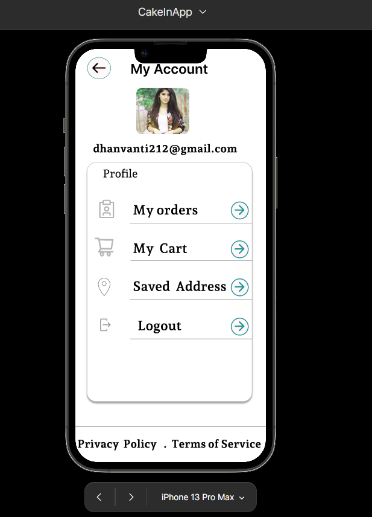
  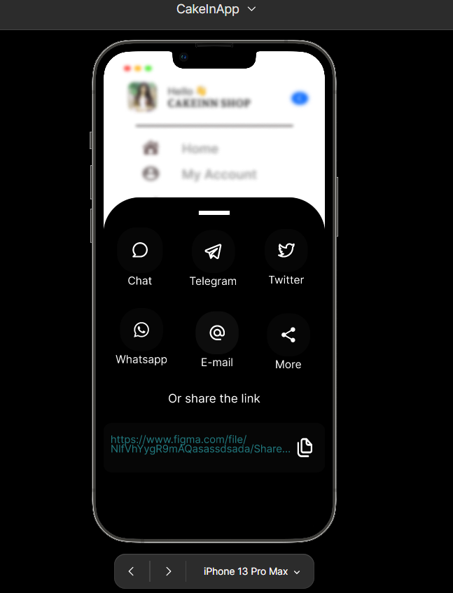
  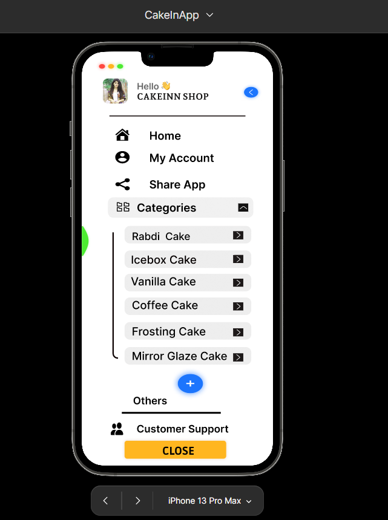
</p>

<br>

<h2>👨‍💻 Author</h2>
<p>
  <strong>Dhanvanti Chelani</strong>
</p>


<h2>📱 Application Flow</h2>

<p align="center">

```text
                    🎂 Cakein
                       │
                       ▼
                 ✨ Splash Screen
                       │
                       ▼
                🔐 Login / Signup
                       │
                       ▼
                   🏠 Home
                       │
        ┌──────────────┼──────────────┐
        ▼              ▼              ▼
     🔎 Search      🍰 All Cakes    ❤️ Wishlist
        │              │              │
        ▼              ▼              ▼
   Search Result   Cake Details    Saved Cakes
        │              │
        └──────────────┤
                       ▼
                 🛍️ Purchase Popup
                       │
                       ▼
                🎂 Additional Cakes
                       │
                       ▼
                    🛒 Cart
                       │
                       ▼
                  💳 Checkout
                       │
                       ▼
                  ✅ Order


